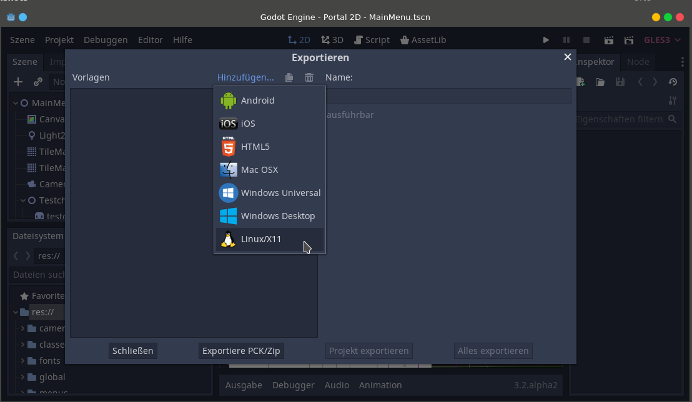
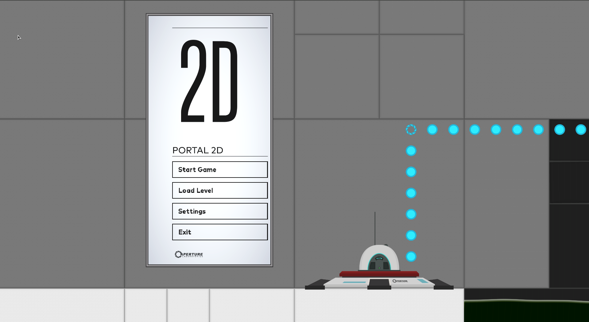
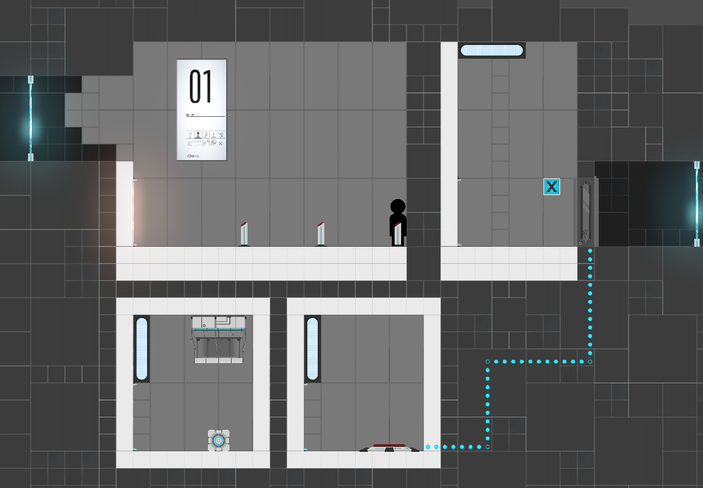
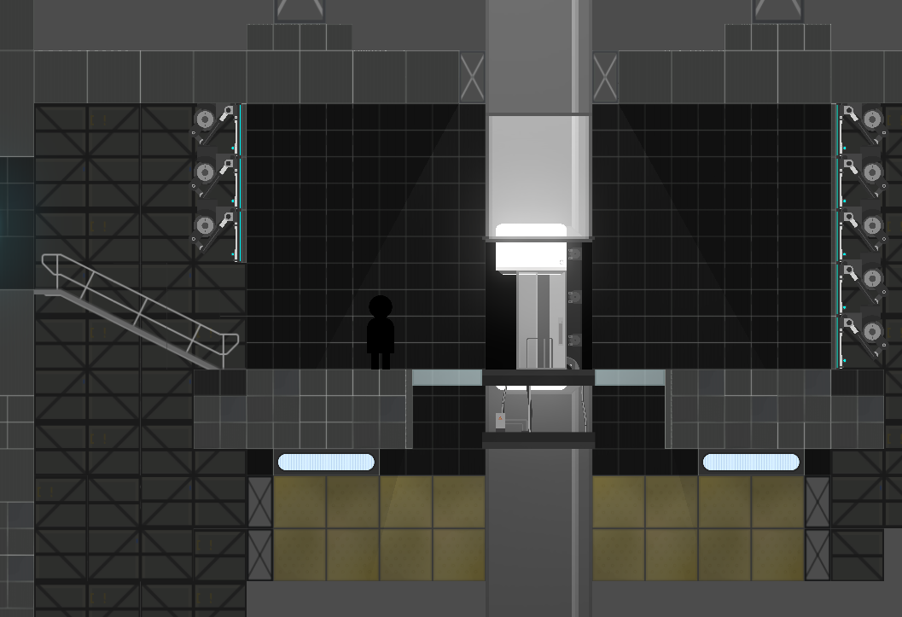
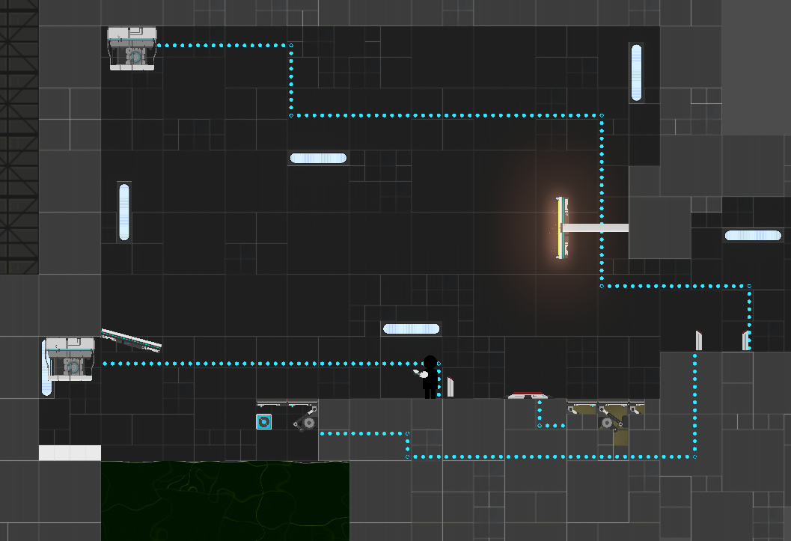

  

<h1 align="center"> Portal2D </h1>  

   Portal2D ist ein 2D remake des Spieleklassikers Portal und dessen Nachfolger Portal2.
In dem Spiel löst man Rätsel mithilfe von Portalen. Durch geschicktes lösen von Rätseln navigiert man "Bendy" durch die athmosphärischen Testkammern von Aperture Science. 

#### Engine

Current Engine version is: [Godot v3.2-beta2](https://downloads.tuxfamily.org/godotengine/3.2/beta2/)

#### Links

* [Link zum Slack-Channel](https://beuth-projekt-ws19.slack.com/messages/CPDPXGGKF/)
* [Link zu Gitmoji](https://gitmoji.carloscuesta.me/)

#### 🎓 Contribution Guide

##### Technik

-  **Godot 3.2** Spieleengine
- Godot Scriptsprache (GDScript)
- Zielplattformen: **Linux**, **MacOS**, **Windows**

##### Get started

- Fork this Project
- Git clone
- open Project in Godot
- make changes to code
- Update the Wiki
- Pull request

##### Build Project

* open Godot 
* Projekt - Exportieren
* Hinzufügen...

* Projekt exportieren

#### Screenshots

|  |  |
| ------------------------------------------------------------ | ------------------------------------------------------------ |
|  |  |

